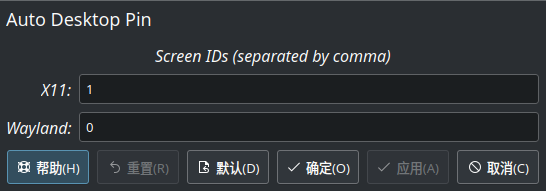

# Auto Desktop Pin Script for KWin

Pin window on selected screen. Pineed windows will not disappear when virtual desktop is switching. Support separated config on X11 session and Wayland session.

<div align='center'></div>

Usually, the ID of second monitor is 1. However, wayland orders the monitor in left-to-right order. So,  when the second monitor is on the left of the primary monitor, the ID of the second monitor is 0. Therefore, we add separated settings for X11 and Wayland.

## Installation

```bash
make install
```